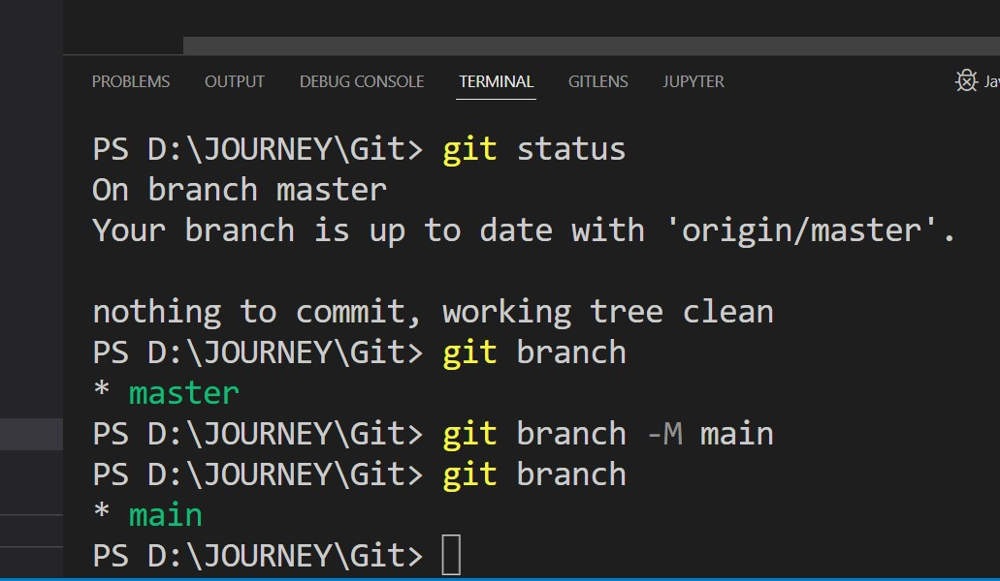
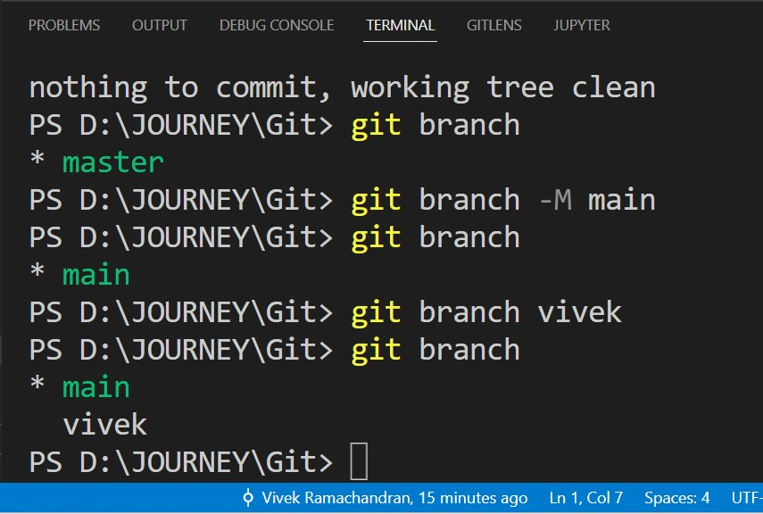
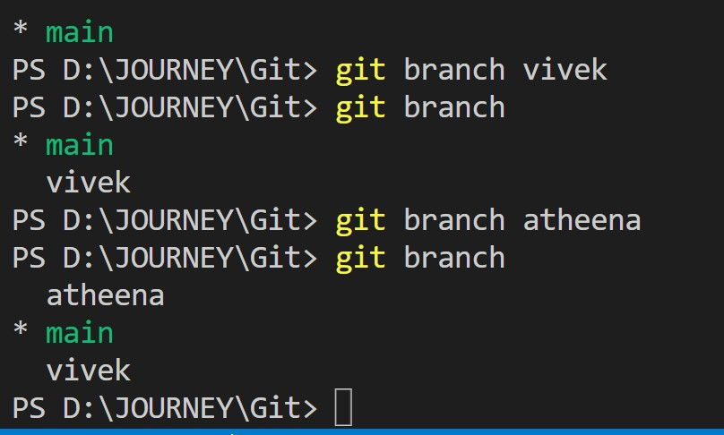
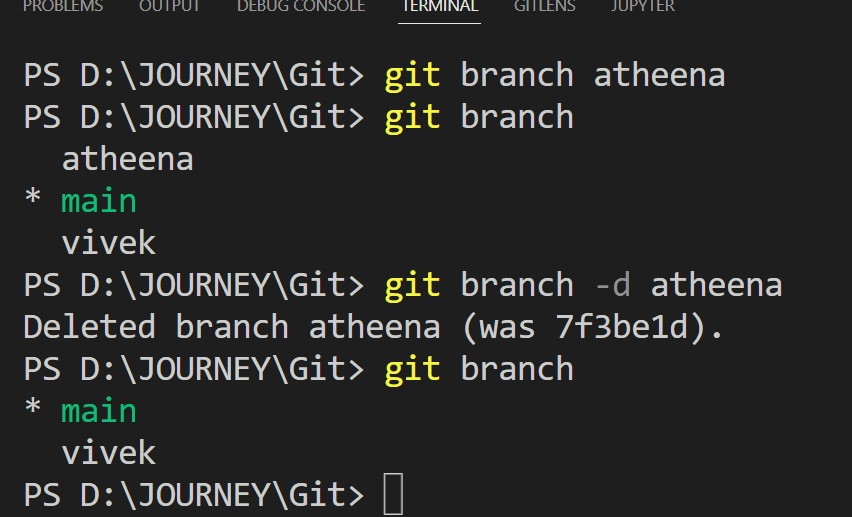

<style>
r { color: Red }
b { color: Brown }
g { color: Green }
o { color: Orange }
bl {color: Blue}

</style>

<r>Git init</r><br/>
Go to a brand new folder and create a file and go to terminal and type ```git init``` <br/>
Once you do that you will notice the file will turn to green color in vscode. <br/>
And git icon will have one on it as shown below

<br/>
Bottom left will show it as ```master``` meaning we are on main branch <br/>


<br/>
By default, vscode hides the ```.git``` folder <br/>
To view it, go to <code>preferences>files.excluded</code> <br/>
<r>How to remove git from a project</r><br/>
As soon as you delete .git folder from your project, you can remove git from your project. <br/>

<r>How to add all files in current directory to staging area</r><br/>
Use the following command ```git add .``` <br/>
 <br/>

If you look at right side of Readme.md you can see ```U``` <br/>
It means file is ```unstaged``` <br/>

When you do ```git add .``` <br/>
You can see ```A``` on the right side of Readme.md <br/>
This means ```file is added to the tracking list``` <br/>
To make the files untracked again use the following command ```git reset .```
File is again ```shown as U on the right side of Readme.md``` <br/>
 <br/>

<r>To add a single file to staging area</r><br/>
git add Readme.md <br/>
Now if you run ```git status``` command it will say one file to be committed as ```it tracks only Readme.md``` <br/>

<r>How to ignore files</r><br/>
There will be files or folders that we will not want git to track. <br/>
Go to <code>preferences>files.excluded</code> and remove ```**/.git``` <br/>
Then you will be able to see ```.git``` folder <br/>

Go to ```.git>info>exclude``` file and mention the file name that you do not want to track <br/>
Now if you type ```git status``` you will will see that git will not show ```secrets.json``` file and you will see that there is neither ```U or A``` icon to the right of ```secrets.json``` file. <br/>

<r>Git log</r><br/>
To see all the commits so far we use ```git log``` command <br/>


<r>If you make any changes to tracked files then that file will be shown as ```yellow``` in color</r><br/>

<r>To commit all the flags in the current directory</r><br/>
Use the following command ```git commit -a -m "message" ```<br/>

<r>Git remote add origin</r><br/>
When you want to sync an online repository in github, first create a repository in github and grab its url. <br/>

Then use the following command <br/>
```git remote add origin https://github.com/CSfasn/gitlessons.git``` <br/>

now, if you type ```git remote``` in terminal it will say ```origin``` <br/>

<r>If you want to know the url of the repository</r><br/>
Use the following command ```git remote -v``` <br/>

<r>To see more details</r><br/>
Use the following command
```git remote show origin``` <br/>

<r>Pushing local code to remote</r><br/>
Whatever code we write locally need to be <strong>pushed</strong> to remote and this is the command to do it.
```git push origin master -u```
<br/>
Here ```origin``` refers to the main code in our remote repository and ```master``` refers to the current branch we are on i.e. ```master``` <br/>
we use ```-u``` when our remote repository which is our file on github is the final source code. 
<br/>
<r>You can edit code directly on github</r><br/>
This is useful for small corrections in our code. <br/>
when you do this, your remote repository is ahead of your local repository. Now you have to sync your local repository with your remote repository. <br/>

<r>Git merge</r><br/>
We now have ```master branch on remote repository```  and ```master branch on local repository``` <br/>
to merge our ```local master branch``` to ```remote master branch``` we use the following command <br/>

```git merge origin/master``` <br/>

<r>Git pull</r><br/>
You can sync local files with remote using ```git pull``` command <br/>
If you have any uncommitted files locally then first commit those changes before you use ```git pull``` command. Else it will throw error. <br/>

<r>git clone</r><br/>
This command is used if you want to save a copy of a remote repository to your local directory to start working on it. You use the following command. ```git clone url``` <br/>

<r>Git branching</r><br/>
To see the list of all current branches use ```git branch``` <br/>

<r>Renaming branch</r><br/>
We can rename our branch name using the following command. <br/>
```git branch -M main``` <br/>

Using this command we are renaming ```Master``` branch to ```main``` <br/>


<br/>
<r>Creating new branch</r><br/>
We use <code>git branch name</code> to create new branch. <br/>



<br/>
As you can see we created new branch called <code>vivek</code> and  using <code>git branch</code> command we can see that <code>main</code> is highlighted in green. That means we are currently on <code>main branch</code><br/>

<r>Deleting a branch</r><br/>
We use the following command.
<code>git branch -d branchname</code>
<br/>
For the sake of argument, i created branch <code>atheena</code> <br/>
 <br/>

using command <code>git branch -d atheena</code> we deleted <code>atheena</code> branch. <br/>
 <br/>

if you use <code>-d</code> it will detele branch only if the branch was not merged with master branch. If you want to delete a branch that was merged with master use <code>-D</code>

